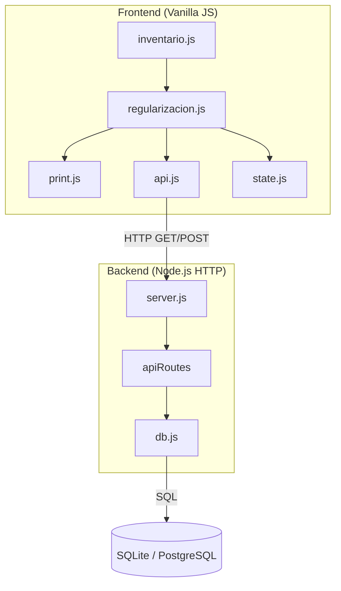
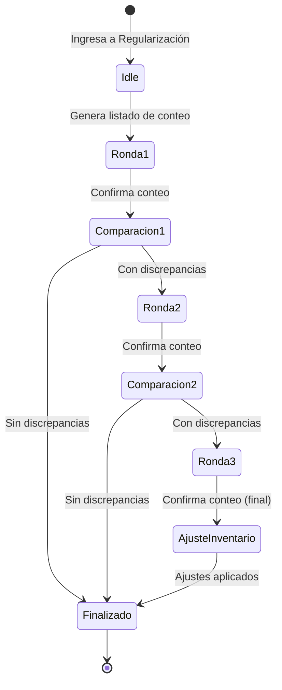

# Design Document: Inventory Regularization

## Overview

El módulo de Regularización de Inventario permite realizar conteos físicos periódicos comparando las cantidades del sistema con las cantidades reales en ubicaciones físicas. El proceso se divide por zonas (Picking: posiciones < 20, Montacarguista: posiciones >= 20), permite hasta 3 rondas de conteo para resolver discrepancias, y genera ajustes automáticos al inventario cuando se confirma la ronda final.

### Decisiones de Diseño Clave

1. **Estado en memoria del cliente**: El proceso de regularización se gestiona en el estado del frontend (`state.js`), sin persistencia de rondas intermedias en la base de datos. Solo la confirmación final de ronda 3 escribe en `inventario_movimientos`.
2. **Reutilización del patrón existente**: Se sigue la arquitectura de tabs del módulo de inventario actual (consulta / carga masiva) añadiendo una tercera pestaña "Regularización".
3. **API de stock existente**: Se reutiliza la consulta de stock por ubicación (`getStockUbicaciones`) como fuente de datos para generar los listados de conteo.
4. **Print utility existente**: Se extiende `print.js` con un nuevo tipo de documento `REGULARIZACION` para generar la hoja de conteo imprimible.

## Architecture



### Flujo del Proceso



## Components and Interfaces

### Backend - Nuevos Endpoints API

| Método | Ruta | Descripción |
|--------|------|-------------|
| `GET` | `/api/inventario/regularizacion/picking` | Lista ítems con stock > 0 en zona picking (pos < 20) |
| `GET` | `/api/inventario/regularizacion/montacarguista` | Lista ítems con stock > 0 en zona montacarguista (pos >= 20) |
| `POST` | `/api/inventario/regularizacion/aplicar` | Aplica ajustes de ronda 3 al inventario |

### Backend - Nuevas Funciones en `db.js`

```javascript
// Obtener listado de regularización para zona picking
async function getRegularizacionPicking() {
    // SELECT con stock neto > 0 WHERE posición < 20
    // Ordenado por ubicacion ASC, codigo ASC
}

// Obtener listado de regularización para zona montacarguista
async function getRegularizacionMontacarguista() {
    // SELECT con stock neto > 0 WHERE posición >= 20
    // Ordenado por ubicacion ASC
}

// Aplicar ajustes de regularización (transaccional)
async function aplicarAjusteRegularizacion(ajustes) {
    // Para cada ajuste: INSERT INTO inventario_movimientos
    // tipo = 'IN' si diferencia > 0, 'OUT' si diferencia < 0
    // documento_referencia = 'REG-{fecha}-{zona}'
}
```

### Frontend - Nuevo Módulo `regularizacion.js`

```javascript
// Estado local del proceso de regularización
let regularizacionState = {
    zona: 'picking',          // 'picking' | 'montacarguista'
    rondaActual: 0,           // 0 = no iniciado, 1-3
    itemsConteo: [],          // Array de items con cantidades del sistema
    conteoIngresado: {},      // Map: key(codigo+ubicacion) => cantidad contada
    discrepancias: [],        // Items con diferencias tras confirmación
    historialRondas: []       // Registro de rondas completadas
};

// Funciones principales exportadas
export function switchRegTab(tab);              // Cambiar sub-pestaña picking/montacarguista
export async function cargarListadoConteo();    // Obtener listado del API
export function registrarConteo(key, valor);    // Registrar cantidad contada
export function validarCantidad(valor);         // Validar input numérico
export function confirmarRonda();               // Confirmar y comparar
export function generarListadoReconteo();       // Filtrar discrepancias para siguiente ronda
export async function aplicarAjustes();         // Enviar ajustes al backend (ronda 3)
export function imprimirHojaConteo();           // Generar hoja imprimible
```

### Frontend - Extensión de `print.js`

Se añade un nuevo caso `REGULARIZACION` en la función `imprimirDocumento()` que genera la hoja de conteo con:
- Encabezado: fecha, zona, número de ronda
- Tabla: nº ítem, código, descripción, ubicación, casilla en blanco
- Pie: espacio de firma y fecha de ejecución

### Frontend - Extensión de `state.js`

```javascript
// Nuevo campo en el estado global
export const state = {
    // ... campos existentes ...
    regularizacionActiva: null  // Referencia al proceso activo (si existe)
};
```

### Frontend - Extensión de `inventario.js`

Se añade la tercera pestaña "Regularización" al panel de tabs existente, reutilizando `switchInvTab()` con un nuevo valor `'regularizacion'`.

## Data Models

### Listado de Conteo (Response del API)

```typescript
interface ItemConteo {
    codigo: string;           // Código del producto
    descripcion: string;      // Descripción del producto
    ubicacion: string;        // Código de ubicación (V + 6 dígitos)
    cantidad_sistema: number; // Stock neto calculado (IN - OUT)
}
```

### Estado del Proceso de Regularización (Frontend)

```typescript
interface RegularizacionState {
    zona: 'picking' | 'montacarguista';
    rondaActual: number;               // 0-3
    itemsConteo: ItemConteo[];         // Items de la ronda actual
    conteoIngresado: Record<string, number | null>; // key = codigo|ubicacion
    discrepancias: ItemDiscrepancia[];
    historialRondas: RondaCompletada[];
}

interface ItemDiscrepancia {
    codigo: string;
    descripcion: string;
    ubicacion: string;
    cantidad_sistema: number;
    cantidad_contada: number;
    diferencia: number;        // contada - sistema
}

interface RondaCompletada {
    numero: number;
    fecha: string;
    totalItems: number;
    totalDiscrepancias: number;
}
```

### Request de Ajuste (POST al backend)

```typescript
interface AjusteRegularizacionRequest {
    zona: string;
    ajustes: AjusteItem[];
}

interface AjusteItem {
    codigo_producto: string;
    ubicacion: string;
    cantidad_sistema: number;
    cantidad_contada: number;
    diferencia: number;        // positivo = IN, negativo = OUT
}
```

### Movimiento de Ajuste (Registro en BD)

El ajuste se registra en la tabla existente `inventario_movimientos`:

| Campo | Valor |
|-------|-------|
| `codigo_producto` | Código del producto ajustado |
| `tipo` | `'IN'` si diferencia > 0, `'OUT'` si diferencia < 0 |
| `documento_referencia` | `'REG-YYYY-MM-DD-{zona}'` (e.g., `REG-2025-01-15-PICKING`) |
| `fecha` | Fecha actual ISO |
| `cantidad` | Valor absoluto de la diferencia |
| `ubicacion` | Ubicación del ítem |

### SQL Query - Listado Picking

```sql
SELECT m.codigo_producto AS codigo, 
       p.descripcion,
       m.ubicacion,
       SUM(CASE WHEN m.tipo = 'IN' THEN m.cantidad ELSE -m.cantidad END) AS cantidad_sistema
FROM inventario_movimientos m
JOIN productos p ON m.codigo_producto = p.codigo
WHERE CAST(SUBSTRING(m.ubicacion, 6, 2) AS INTEGER) < 20
GROUP BY m.codigo_producto, p.descripcion, m.ubicacion
HAVING SUM(CASE WHEN m.tipo = 'IN' THEN m.cantidad ELSE -m.cantidad END) > 0
ORDER BY m.ubicacion ASC, m.codigo_producto ASC
```

### SQL Query - Listado Montacarguista

```sql
SELECT m.codigo_producto AS codigo,
       p.descripcion,
       m.ubicacion,
       SUM(CASE WHEN m.tipo = 'IN' THEN m.cantidad ELSE -m.cantidad END) AS cantidad_sistema
FROM inventario_movimientos m
JOIN productos p ON m.codigo_producto = p.codigo
WHERE CAST(SUBSTRING(m.ubicacion, 6, 2) AS INTEGER) >= 20
GROUP BY m.codigo_producto, p.descripcion, m.ubicacion
HAVING SUM(CASE WHEN m.tipo = 'IN' THEN m.cantidad ELSE -m.cantidad END) > 0
ORDER BY m.ubicacion ASC
```

## Correctness Properties

*A property is a characteristic or behavior that should hold true across all valid executions of a system—essentially, a formal statement about what the system should do. Properties serve as the bridge between human-readable specifications and machine-verifiable correctness guarantees.*

### Property 1: Zone filtering correctness

*For any* set of inventory movements and a given zone (picking or montacarguista), all items returned by the zone listing function SHALL have a location position code that falls within the zone's range (< 20 for picking, >= 20 for montacarguista) AND each item SHALL have a stock > 0.

**Validates: Requirements 2.1, 3.1**

### Property 2: Zone listing field completeness

*For any* item returned in a zone listing (picking or montacarguista), the item SHALL contain non-null values for all required fields: codigo (non-empty string), descripcion (non-empty string), ubicacion (matching format V + 6 digits), and cantidad_sistema (positive number).

**Validates: Requirements 2.2, 3.2**

### Property 3: Zone listing sort order

*For any* list of items returned by the picking zone listing, the items SHALL be sorted by ubicacion in ascending alphanumeric order, and for items with equal ubicacion, by codigo in ascending order. *For any* list returned by the montacarguista zone listing, items SHALL be sorted by ubicacion in ascending alphanumeric order.

**Validates: Requirements 2.3, 3.3**

### Property 4: Print zone isolation

*For any* regularization count sheet generated for a specific zone, every item in the printed output SHALL belong exclusively to that zone (position < 20 for picking, position >= 20 for montacarguista), and no item from the other zone SHALL appear.

**Validates: Requirements 4.4**

### Property 5: Count input validation

*For any* input value, the validation function SHALL accept the value if and only if it is an integer >= 0 AND <= 999,999. All other values (non-numeric, negative, decimal, or exceeding 999,999) SHALL be rejected.

**Validates: Requirements 5.2, 5.3**

### Property 6: Discrepancy detection correctness

*For any* pair of system quantity and counted quantity for a given item, the comparison function SHALL identify a discrepancy if and only if the counted quantity differs from the system quantity. The calculated difference SHALL equal (cantidad_contada - cantidad_sistema).

**Validates: Requirements 6.1**

### Property 7: Next-round filtering

*For any* set of items after a round 1 or round 2 comparison, the next round's item list SHALL contain exactly those items where the counted quantity differs from the system quantity, and SHALL exclude all items where the counted quantity equals the system quantity.

**Validates: Requirements 6.2, 7.2**

### Property 8: Incomplete count blocking

*For any* round confirmation attempt where N items have no recorded count (empty/null), the system SHALL block the confirmation and report exactly N pending items.

**Validates: Requirements 6.6**

### Property 9: Final round adjustment movement types

*For any* item confirmed in round 3 where the counted quantity differs from the system quantity, the system SHALL generate an inventory movement with type 'IN' if (counted - system) > 0, or type 'OUT' if (counted - system) < 0, with cantidad equal to the absolute value of the difference.

**Validates: Requirements 6.5, 7.3, 7.4**

### Property 10: Adjustment summary completeness

*For any* completed regularization process with adjustments, the summary SHALL contain for each adjusted item: codigo, ubicacion, cantidad_anterior (equal to system quantity), cantidad_nueva (equal to counted quantity), and diferencia (equal to cantidad_nueva - cantidad_anterior). The diferencia field SHALL be mathematically consistent: diferencia = cantidad_nueva - cantidad_anterior.

**Validates: Requirements 7.5**

## Error Handling

### Backend Errors

| Escenario | Comportamiento |
|-----------|---------------|
| Producto no existe en catálogo | Retornar 404 con mensaje descriptivo. Excluir del listado de regularización. |
| Error de conexión a BD | Retornar 500 con `{ error: "Error interno en el servidor." }` |
| Error parcial durante aplicación de ajustes (ronda 3) | Revertir todas las inserciones de la transacción. Retornar 500 con mensaje indicando que no se completó la actualización. El frontend mantiene el estado de ronda 3 pendiente. |
| Ubicación con formato inválido en datos existentes | Excluir del listado y registrar en consola. No interrumpir el proceso. |

### Frontend Errors

| Escenario | Comportamiento |
|-----------|---------------|
| API timeout (> 5 segundos) | Mostrar mensaje "Error al cargar el listado de conteo. Intente nuevamente." y mantener estado actual. |
| Input de conteo inválido | Resaltar campo con borde rojo, rechazar valor, mantener último valor válido. |
| Confirmación con campos vacíos | Bloquear botón, mostrar alerta con cantidad de ítems pendientes. |
| Intento de iniciar ronda 4 | Mostrar mensaje "El proceso de regularización ya ha sido finalizado (máximo 3 rondas)." |
| Error al aplicar ajustes en ronda 3 | Mostrar alerta de error, mantener ronda 3 activa para reintento. No limpiar datos del conteo. |
| Error durante comparación automática | Mantener proceso activo, mostrar mensaje de error, permitir reintento. |

### Atomicidad de Ajustes (Ronda 3)

Para SQLite se usa una transacción implícita (todas las inserciones en secuencia dentro de un try/catch). Para PostgreSQL se usa una transacción explícita (`BEGIN`/`COMMIT`/`ROLLBACK`) para garantizar que si cualquier ajuste falla, no se aplique ninguno.

## Testing Strategy

### Unit Tests (Example-Based)

- **UI Tab Navigation**: Verificar que las pestañas y sub-pestañas se muestran/ocultan correctamente (Reqs 1.1-1.5).
- **Empty States**: Verificar mensajes cuando no hay ítems en una zona (Reqs 2.4, 3.4, 4.5).
- **Print Document Structure**: Verificar que la hoja imprimible contiene encabezado, tabla y pie con los campos requeridos (Reqs 4.1-4.3, 4.6).
- **Early Termination**: Verificar que el proceso finaliza si no hay discrepancias en rondas 1 o 2 (Reqs 8.1-8.3).
- **Max Rounds**: Verificar que la ronda 4 es rechazada (Req 7.1).
- **Transaction Rollback**: Verificar que un error durante ajustes no deja cambios parciales (Req 7.6).

### Property-Based Tests

Se usará **fast-check** como librería de property-based testing para JavaScript/Node.js.

Cada property test ejecutará un mínimo de **100 iteraciones**.

Los tests de propiedades cubren las siguientes properties del diseño:

| Property | Tag |
|----------|-----|
| Property 1: Zone filtering | `Feature: inventory-regularization, Property 1: Zone filtering correctness` |
| Property 2: Field completeness | `Feature: inventory-regularization, Property 2: Zone listing field completeness` |
| Property 3: Sort order | `Feature: inventory-regularization, Property 3: Zone listing sort order` |
| Property 4: Print zone isolation | `Feature: inventory-regularization, Property 4: Print zone isolation` |
| Property 5: Input validation | `Feature: inventory-regularization, Property 5: Count input validation` |
| Property 6: Discrepancy detection | `Feature: inventory-regularization, Property 6: Discrepancy detection correctness` |
| Property 7: Next-round filtering | `Feature: inventory-regularization, Property 7: Next-round filtering` |
| Property 8: Incomplete count blocking | `Feature: inventory-regularization, Property 8: Incomplete count blocking` |
| Property 9: Adjustment movements | `Feature: inventory-regularization, Property 9: Final round adjustment movement types` |
| Property 10: Summary completeness | `Feature: inventory-regularization, Property 10: Adjustment summary completeness` |

### Integration Tests

- **API GET /api/inventario/regularizacion/picking**: Verificar respuesta correcta con datos reales.
- **API GET /api/inventario/regularizacion/montacarguista**: Verificar respuesta con datos de zona alta.
- **API POST /api/inventario/regularizacion/aplicar**: Verificar que los movimientos se escriben correctamente en la BD y que el stock resultante es el esperado.
- **Transaccionalidad**: Simular un fallo a mitad de la aplicación de ajustes y verificar rollback.
